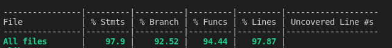

# Node-custom-tlv

* tlv-lib for parsing custom tlb buffers or strings into jsons
* библиотека для парсинга собственных tlv строк/буфферов в формат json

## Prerequisites || Необходимые условия
Убедитесь, что у вас установлен node.js 
Make sure that yoy globally install node.js
https://nodejs.org/en/


##### Usage || как использовать:
* npm install node-custom-tlv
* next import lib
* then customize settings object for parse
* to define labels - be careful to define tags with it nested properties
* if "00A6" tag has nested propeties, it has {nested: true} in dictionary object. As a result we will parse chickensLevel : { chickenLevelId : {...}, specChickenName: { ...}} structure.

* "baseTagLength: 2" - the byte symbols length in tlv string will be "0002" - 2. If you want write "02" - define "1"
* "baseLengthTlvLength" - 1 byte for define tlv length. You can change it/
* customByteLengths - custom lengths bytes. If you need


```
 const NodeCustomTlv = require("NodeCustomTlv")

 const tagDictionary = {
  "0002": { name: "hoddog" },
  "0003": { name: "hotchicken" },
  "0004": { name: "codeChicken" },
  "0081": { name: "errorChicken" },
  "00A5": { name: "chickencount" },
  "00A6": {
    name: "chickensLevel",
    nested: true
  },
  "00A6-0001": { name: "chickenLevelId" },
  "00A6-0002": { name: "specChickenName" },
  "00A6-0003": { name: "hotDogPort" }
 
 }

const settings = {
    dictionary: tagDictionary,
    baseTagLength: 2,
    baseLengthTlvLength: 1,
    customByteLengths: [
      {
        startByte: "81",
        nextByteLengthDefine: 1
      },
      {
        startByte: "82",
        nextByteLengthDefine: 2
      },
      {
        startByte: "83",
        nextByteLengthDefine: 3
      }
    ]
  };
}

const str = "000204000000000003010200a6820129000302300d"

const tlvParser = new NodeCustomTlv(settings)

const result = tlvParser.parseTlv(str) // { hoddog: 0, chickensLevel: { hotDogPort: 12301 } }

```
 * "customByteLengths" - "startBite: "81" and nextByteLengthDefine: 1   means that when length bytes started with "81",
 the true value.length will be in next 1 byte:

```
00 0d  81 b6  2f 76 61 72 2f 6c 6f 67 2f 76 6f 6d 62 61 74 2f 74 6c 73 ...    
 ```         
000d- tag
81 b6 - in one byte "b6" we have length of value. 182 bytes.

 
#### Test coverage || покрытие тестов
* coverage is 97.8%
* to run tests:
** npm i
** npm run test -
** 


 